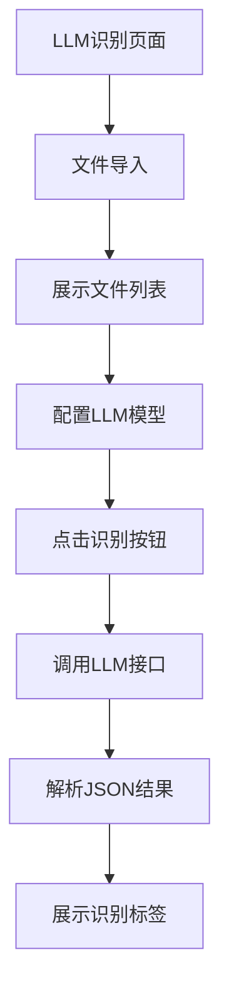

## 1. Product Overview
开发一个具备文件导入和LLM模型识别功能的页面，用于从动画视频文件名中解析出详细的视频信息。该页面将帮助用户快速获取视频文件的元数据信息，包括标题、季数、集数、分辨率等。

## 2. Core Features

### 2.1 User Roles
该产品主要面向动画收藏爱好者和视频整理用户，无需复杂的用户角色区分。

### 2.2 Feature Module
我们的LLM模型识别页面包含以下主要功能：
1. **文件导入页面**：文件夹选择、文件列表展示、文件类型过滤。
2. **LLM模型配置页面**：模型地址配置、模型名称输入、识别按钮。
3. **结果展示页面**：JSON结果解析、标签形式展示、美观的UI布局。

### 2.3 Page Details
| Page Name | Module Name | Feature description |
|-----------|-------------|---------------------|
| 文件导入页面 | 文件夹选择模块 | 允许用户选择包含视频文件和字幕文件的文件夹，支持拖拽导入。 |
| 文件导入页面 | 文件列表模块 | 以列表形式清晰展示导入文件夹中的所有文件名，区分视频和字幕文件。 |
| LLM模型配置页面 | 模型配置模块 | 提供模型地址输入框和模型名称输入框，支持用户自定义LLM模型配置。 |
| LLM模型配置页面 | 识别按钮模块 | 提供醒目的识别按钮，触发LLM模型调用。 |
| 结果展示页面 | JSON解析模块 | 解析LLM模型返回的JSON格式结果，提取各项视频信息。 |
| 结果展示页面 | 结果展示模块 | 在原文件名下方以标签形式展示解析结果，保持与重命名字幕界面一致的标签样式。 |

## 3. Core Process
用户操作流程：
1. 用户进入LLM模型识别页面
2. 选择包含视频文件的文件夹或拖拽文件到指定区域
3. 系统在列表中展示所有导入的文件名
4. 用户配置LLM模型地址和模型名称
5. 用户点击识别按钮
6. 系统调用LLM模型接口，发送文件名进行识别
7. 系统接收并解析JSON格式的识别结果
8. 在文件名下方以标签形式展示解析出的视频信息

## 4. User Interface Design

### 4.1 Design Style
- **主色调**：使用Ant Design的默认蓝色系作为主色调
- **按钮样式**：采用Ant Design的圆角按钮风格
- **字体**：使用系统默认字体，主要字号为14px
- **布局风格**：采用卡片式布局，左右分栏设计
- **标签样式**：与现有重命名字幕界面的标签样式保持一致

### 4.2 Page Design Overview
| Page Name | Module Name | UI Elements |
|-----------|-------------|-------------|
| 文件导入页面 | 文件夹选择区域 | 使用大按钮提供文件夹选择和文件选择功能，支持拖拽区域设计。 |
| 文件导入页面 | 文件列表区域 | 采用左右分栏的卡片布局，左侧显示视频文件，右侧显示字幕文件，每个文件显示名称和类型标签。 |
| LLM模型配置页面 | 配置输入区域 | 提供两个输入框分别用于模型地址和模型名称，输入框上方有清晰的标签说明。 |
| LLM模型配置页面 | 识别按钮区域 | 使用醒目的主要按钮，按钮文字为"开始识别"，支持加载状态显示。 |
| 结果展示页面 | 结果标签区域 | 在每个文件名下方显示解析结果的标签，包括标题、季数、集数、分辨率等信息，使用不同颜色的标签区分不同类型的信息。 |

### 4.3 Responsiveness
采用桌面优先的设计方案，确保在桌面端有最佳的用户体验。同时适配不同屏幕尺寸，在移动设备上能够正常显示和操作。支持触摸交互优化。