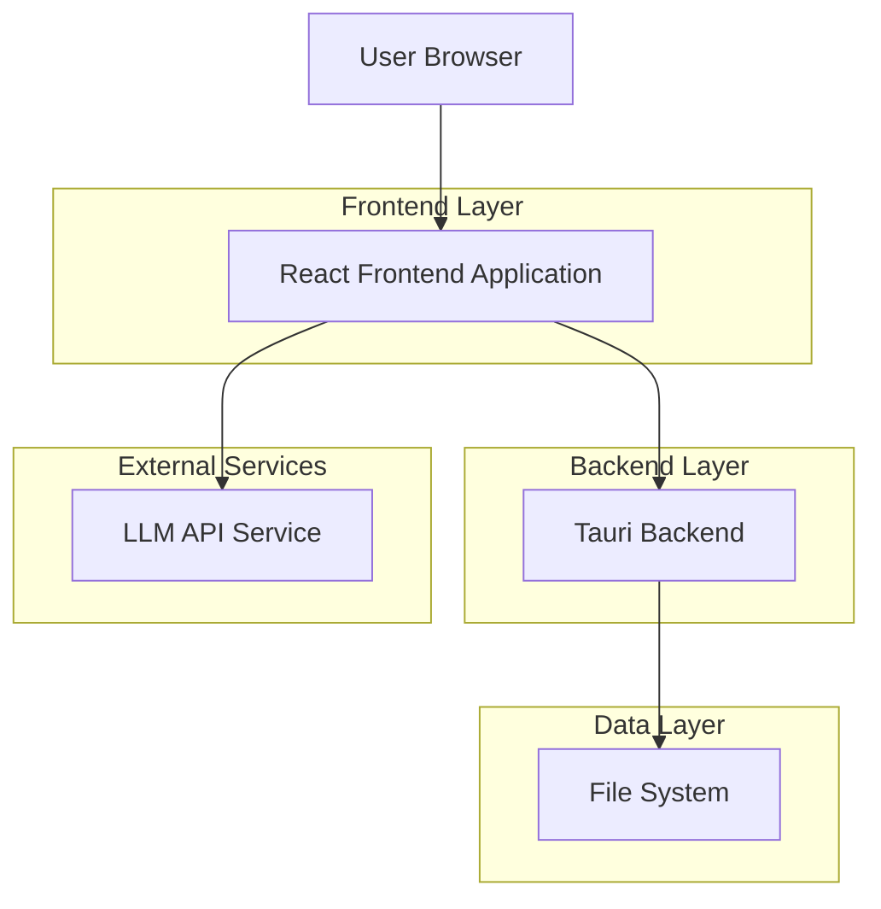
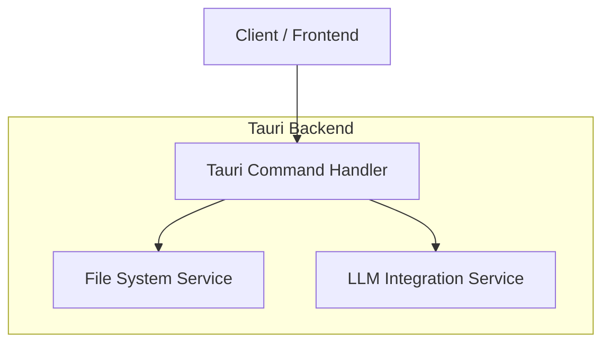
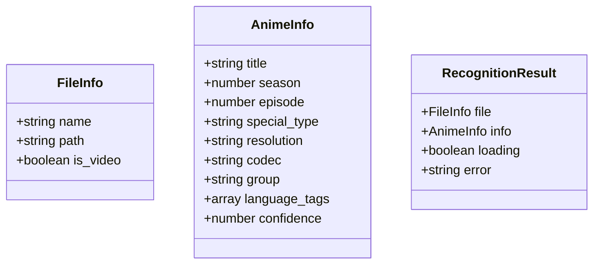

## 1.Architecture design



## 2.Technology Description

- **Frontend**: React@19 + Ant Design@6 + TypeScript
- **Initialization Tool**: Vite (通过Rsbuild配置)
- **Backend**: Tauri@2 (Rust)
- **UI Framework**: Ant Design组件库
- **Build Tool**: Rsbuild

## 3.Route definitions

| Route | Purpose |
|-------|---------|
| /llm-recognition | LLM模型识别页面，提供文件导入和模型识别功能 |
| / | 主页，导航到不同功能模块 |

## 4.API definitions

### 4.1 Core API

文件信息获取相关
```
POST /api/get_dropped_files
```

Request:
| Param Name | Param Type | isRequired | Description |
|-----------|-------------|-------------|-------------|
| paths | string[] | true | 文件路径数组 |

Response:
| Param Name | Param Type | Description |
|-----------|-------------|-------------|
| files | FileInfo[] | 文件信息数组 |

FileInfo结构:
```typescript
interface FileInfo {
    name: string;
    path: string;
    is_video: boolean;
}
```

LLM模型识别相关
```
POST /api/analyze_filename
```

Request:
| Param Name | Param Type | isRequired | Description |
|-----------|-------------|-------------|-------------|
| filename | string | true | 视频文件名 |
| model_url | string | true | LLM模型地址 |
| model_name | string | true | 模型名称 |

Response:
| Param Name | Param Type | Description |
|-----------|-------------|-------------|
| success | boolean | 识别是否成功 |
| data | AnimeInfo | 解析出的动画信息 |
| error | string | 错误信息 |

AnimeInfo结构:
```typescript
interface AnimeInfo {
    title: string;
    season: number;
    episode: number;
    special_type: string | null; // "SP", "OVA", "Movie"
    resolution: string;
    codec: string;
    group: string;
    language_tags: string[];
    confidence: number; // 0.0 to 1.0
}
```

## 5.Server architecture diagram



## 6.Data model

### 6.1 Data model definition

本应用主要处理文件信息和LLM识别结果，无需持久化数据库。数据结构如下：



### 6.2 Data Definition Language

无需数据库表结构定义，数据在内存中处理。

## 7.Implementation Details

### 7.1 文件导入实现
- 复用现有`get_dropped_files`命令处理文件拖放
- 复用`pick_files_and_get_info`和`pick_directory_and_get_info`命令处理文件选择
- 文件类型过滤逻辑与现有字幕重命名功能保持一致

### 7.2 LLM集成实现
- 新增`analyze_filename`命令处理LLM模型调用
- 使用OpenAI风格接口格式发送请求
- 实现错误处理机制：网络错误、超时、格式错误
- 添加请求重试机制和加载状态管理

### 7.3 UI组件设计
- 采用与现有应用一致的Ant Design组件风格
- 结果展示使用标签形式，与重命名字幕界面的预览样式保持一致
- 实现响应式布局，适配不同屏幕尺寸
- 添加加载动画和错误提示

### 7.4 错误处理
- 文件读取错误：显示友好的错误提示
- LLM调用错误：区分网络错误、超时错误、格式错误
- 结果解析错误：提供详细的错误信息
- 用户输入验证：验证模型地址和名称的格式